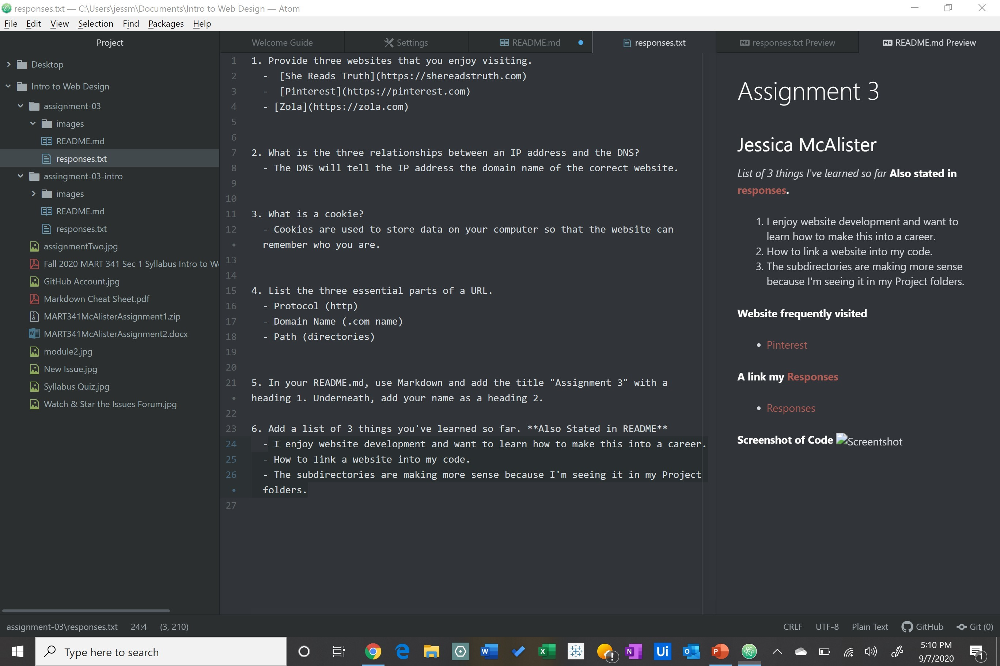

# Assignment 3
## Jessica McAlister

*List of 3 things I've learned so far* **Also stated in [responses](./assignment-03/responses.txt).**
1. I enjoy website development and want to learn how to make this into a career.
2. How to link a website into my code.
3. For images, you don't need to but the first file name. You can start with just the file name where you image is. (You don't need to say, "./assignment-03/images/screenshot-03.jpg")

**Website frequently visited**
- [Pinterest](https://www.pinterest.com)
- [She Reads Truth](https://www.shereadstruth.com)
- [Zola](https://www.zola.com)

**A link my [Responses](./assignment-03/responses.txt)**
  - [Responses](./assignment-03/responses.txt)

**Screenshot of Code**

