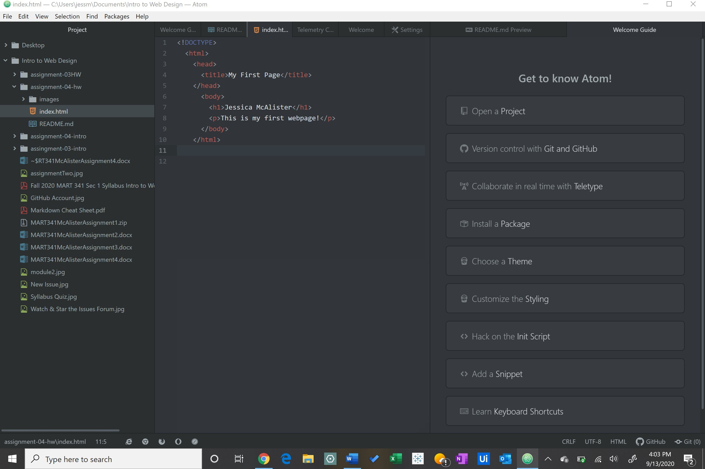

**How Browsers Function**

Browsers function by a render engine interacts through a network and takes in the HTML and CSS code, reads it using the DOM, and displays it. I mostly use Google Chrome because it's the easiest to use.

**What is a Markup Language**

A markup language is used to format the content of text. It focuses on its text content and dictates the page's architecture. A commonly used markup language for web development is HTML (Hypertext Markup Language). It is the foundation and structure of a page's content.

**Index Screenshot**

