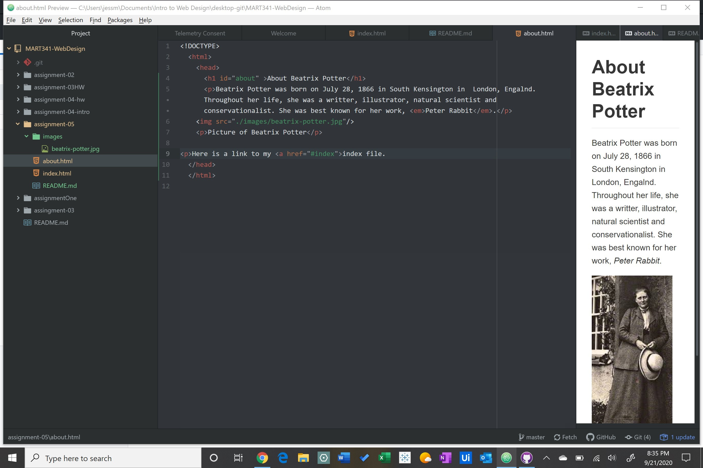

<h1>The Way Back Machine</h1>
<h3>Facebook.com</h3>
<ul>
<li><b>Where did you go?</b></li>

I went to Facebook.com on May 29, 2006.

<li><b>What did it look like?</b></li>

It looks completely different than the Facebook website we see today. The login page was minimal. Only explaining within three bullet points what a user can do on Facebook.com.

<li><b>How has it changed?</b></li>
Facebook has a lot more functionality than just looking up people around you, see how people know each other, and make groups and events with your friends. Now, a user can still do all of those things, but can also buy and sell on Facebook Marketplace, upload pictures for memories, and post thoughts and life milestones.

<h3>My Experience with the Topics</h3>

These last few topics have been fun for me. I enjoy looking through the examples of html code on the website and try to replicate them. I try to use as much new knowledge from the examples in my homework so that I can see how they work in real life. I'm still struggling with internal linking something within the Atom application. I'm struggling with linking my index.html and about.html together.

This is my screenshot of my about.html page.

